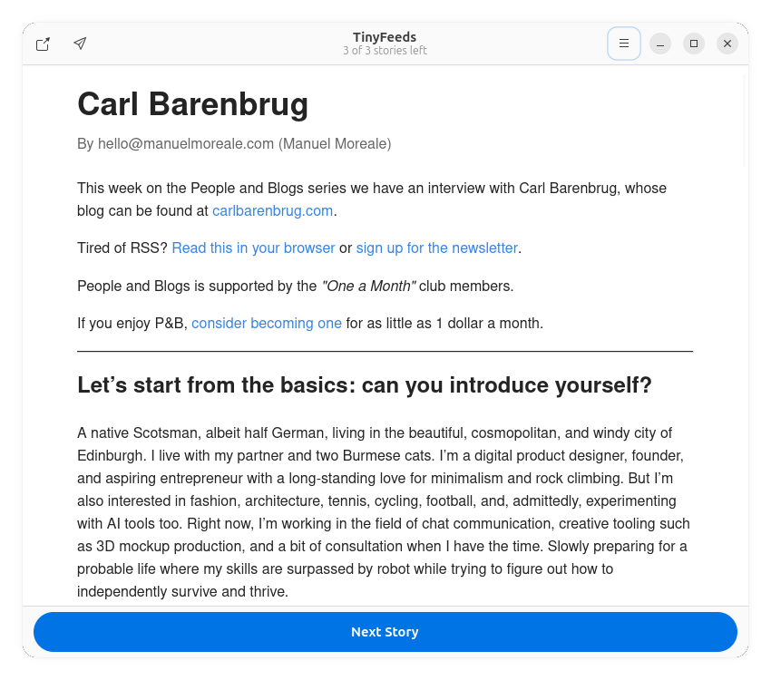

# TinyFeeds

A tiny, highly opionated, minimal RSS feed reader.

## Features

- View unread posts from today
- Distraction free interface that helps you focus on one post at a time
- Under 5MB binary size (goal)
- Configuration driven by ~/.config/tinyfeeds/feeds.txt

## Building

**Requirements**

- Rust, cargo
- `upx` (if using the `build.sh` script)
- `appimagetool` if making an AppImage

### Optimized Native Binary

Run `./build.sh` in the base project directory. This will run a release build then compress it with `upx`. Resulting file will be `target/release/tinyfeeds`.

### AppImage

Run `cargo appimage` in the base project directory. Resulting file will be `target/appimage/tinyfeeds.AppImage`.

## FAQs

### How do I add feeds?

After first starting the app, a new file will be created at `~/.config/tinyfeeds/feeds.txt`. Add the URLs to RSS feeds in this file (one per line).

### Can I import an OPML file?

Sure! Use this command to convert your OPML file to the `feeds.txt` file TinyFeeds uses:

`grep -oP 'xmlUrl="\K[^"]+' input.opml > ~/.config/tinyfeeds/feeds.txt`

## Todo

- [ ] Ability to export an article as a markdown document
- [ ] If a story has no content, show a message "The author would like you to view this on their website" with a button
- [x] Progressively load feeds, holy crap it's slow with just 43 feeds
- [x] Save viewed feeds in a ~/.config/tinyfeeds/viewed.txt file
- [ ] Reset viewed feeds on new day
- [ ] Add button to open feeds.txt in $EDITOR for easy access
- [ ] Add author and URL information to post view
- [x] Add button to open post in browser
- [ ] Support for user configured timeout
- [ ] Support for user configured theme
- [ ] Better rendering of content
  - [ ] Custom styling
  - [x] View images
  - [ ] Change themes
  - [x] Working hyperlinks
